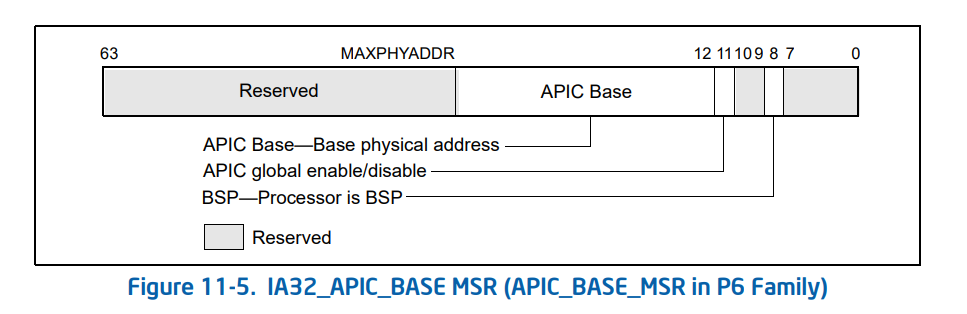

<https://kagurazakakotori.github.io/ubmp-cn/index.html>
<https://zhuanlan.zhihu.com/p/393195942>
<https://blog.csdn.net/lyk82698/article/details/127859712>
<https://github.com/yongkangluo/Ubuntu20.04OS/blob/main/Files/Lec7-ExternalInterrupt/hal/apic.c#L95>

```c
#define APIC_BASE_VADDR 0x1000
#define __APIC_BASE_PADDR 0xFEE00000
#define apic_read_reg(reg)           (*(uint32_t*)(APIC_BASE_VADDR + (reg)))
#define apic_write_reg(reg, val)     (*(uint32_t*)(APIC_BASE_VADDR + (reg)) = (val))

void
apic_setup_lvts()
{
    apic_write_reg(APIC_LVT_LINT0, LVT_ENTRY_LINT0(APIC_LINT0_IV));
    apic_write_reg(APIC_LVT_LINT1, LVT_ENTRY_LINT1);
    apic_write_reg(APIC_LVT_ERROR, LVT_ENTRY_ERROR(APIC_ERROR_IV));
}
```

```nasm
; 0x1BF = IA32_APIC_BASE MSR
movl $0x1B, %ecx
rdmsr ; 将会返回相应的MSR中64bit信息到EAX（低32位）EDX（高32位）
; Enables the local APIC
orl $0x800, %eax
wdmsr
```



- [ ] 禁用中断
- [ ] 禁用8259PIC
- [ ] 硬启用LAPIC
- [ ] 初始化LAPIC
- [ ] 设置中断优先级
- [ ] 初始化LVT
- [ ] 软启用LAPIC
- [ ] 初始化I/O APIC
- [ ] 映射IRQ至中断
- [ ] 打开中断

### CPUID

EFLAGS中的bit 21可以识别CPU是否支持CPUID指令，在支持CPUID指令的CPU中，这一位将为1。
[CPUID详解，参考这篇文章](https://www.cnblogs.com/DeeLMind/p/7535028.html)

```nasm
mov eax, 0
cpuid
```